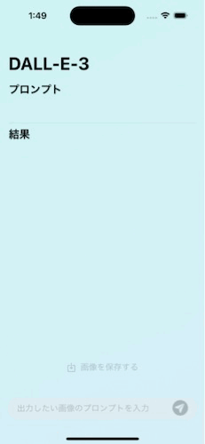
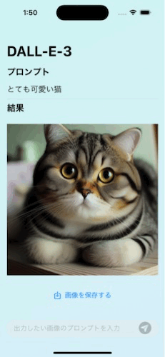
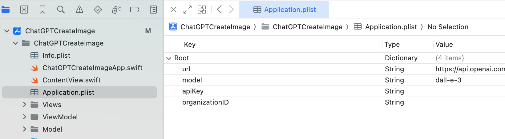
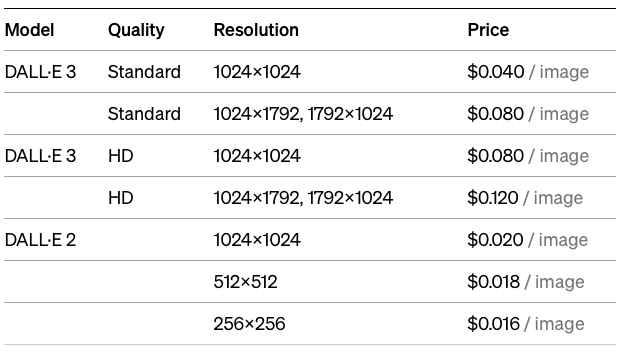

# ChatGPT Create Image
ChatGPTが写真を作成します

# アプリの仕様
テキストフィールドに入力されたテキストを送信し、作成され画像を受け取るアプリ

## 動作
- TextFieldにどのような画像を生成してほしいか入力する
- OpenAIのAPIを使用しDALL-E3に画像を生成してもらう
- 生成された画像を受け取りViewに表示する
  - 表示された画像は保存できるようにする

## 実際の動作
- 今回取得する画像の大きさは`1024 x 1024`と設定した

### リクエストから画像の表示

### 画像の保存

分かりにくいので後で差し替えます

# 開発環境
環境|バージョン
---|---
IDE| Xcode 15.0.1
Swift| Swift 5.9
ターゲットOS | iOS16.0以上
モデル | DALL-E 3 (変更可能)

## API Keyやモデルの変更について
- プロジェクトの`Application.plist`のmodelのValueを書き換えると画像生成AIのモデルを変更できます。
- TalkWithChatGPTと同様にAPI KeyとOrganization IDを入力すると使用することができます。

# 注意点
- APIの使用にお金がかかります。(下の図を参照)
  
  
  出典: [OpenAIの料金ページ](https://openai.com/pricing#language-models)

# 参考にしたサイト
これらのサイトや今までの課題アプリを参考に作成しました!

まだまだ参考にしたサイトはあるので今後追加します

- [OpenAI 公式APIリファレンス Images](https://platform.openai.com/docs/api-reference/images/object)

- [【SwiftUI】Data型とUIImage型を相互変換して、画像をデータとして保存したりデータから画像を取得して表示したりする方法](https://zenn.dev/z_ypi/articles/7eb77c26918969)

- [【SwiftUI】画像をカメラロールに保存する。](https://byceclorets.com/swift/save-image/)
- [How to save images to the user’s photo library](https://www.hackingwithswift.com/books/ios-swiftui/how-to-save-images-to-the-users-photo-library)